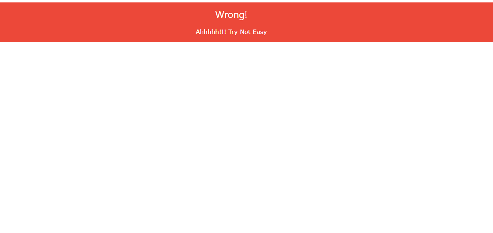
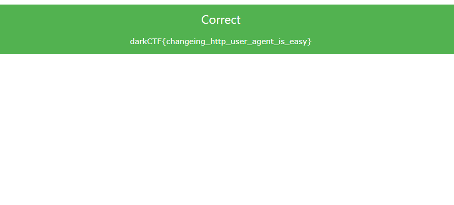

<nav style="background:#1e1e1e;color:#fff;padding:10px;display:flex;gap:15px;font-family:Arial,Helvetica,sans-serif;">
<a href="https://0xlightning.github.io/CTF-Players/" style="color:#00D9FF;text-decoration:none;">Home</a>
<a href="https://0xlightning.github.io/CTF-Players/2020/" style="color:#00D9FF;text-decoration:none;">2020</a>
</nav>
<div style="margin:10px 0;font-size:14px;"><span style="color:#00D9FF"><a href="https://0xlightning.github.io/CTF-Players/" style="color:#00D9FF;text-decoration:none;">Home</a></span> &gt; <span style="color:#00D9FF"><a href="https://0xlightning.github.io/CTF-Players/2020/" style="color:#00D9FF;text-decoration:none;">2020</a></span> &gt; <span style="color:#00D9FF"><a href="https://0xlightning.github.io/CTF-Players/2020/DARKCTF/" style="color:#00D9FF;text-decoration:none;">DARKCTF</a></span></div>

# WRITEUP 2020 [TEAM](https://ctftime.org/team/134537)
# WEB 

## Source 
Points : 100

## Description

>Don't know source is helpful or not !!

>http://web.darkarmy.xyz

## Attachments
 > [index.php](files/index.html)

## Solution
The provided URL links to this page.



In the provided source code there is a small php code.

```php
$web = $_SERVER['HTTP_USER_AGENT'];
if (is_numeric($web)){
      if (strlen($web) < 4){
          if ($web > 10000){
                 echo ('<div class="w3-panel w3-green"><h3>Correct</h3><p>darkCTF{}</p></div>');
          } else {
                 echo ('<div class="w3-panel w3-red"><h3>Wrong!</h3> <p>Ohhhhh!!! Very Close  </p></div>');
          }
      } else {
             echo ('<div class="w3-panel w3-red"><h3>Wrong!</h3><p>Nice!!! Near But Far</p></div>');
      }
} else {
    echo ('<div class="w3-panel w3-red"><h3>Wrong!</h3><p>Ahhhhh!!! Try Not Easy</p></div>');
}
?>
```

>The code checks the user agent against three conditions:
>* If it's numeric
>* If its length is less than 4
>* If its value is greater than 10000
>
>At first i didn't know what value could meet these conditions simultaneously, because of course there's no way
>that a number is greater than 10000 and its length is less than 4 at the same time.
>But then i remembered that PHP allows numbers to be written in scientific notation (ie. 5e10) so i changed my user agent to `9e5`
>which is numeric, its length is 3 and its value is 900000.
>I reloaded the page and got the flag.



>Flag : darkCTF{changeing_http_user_agent_is_easy}
