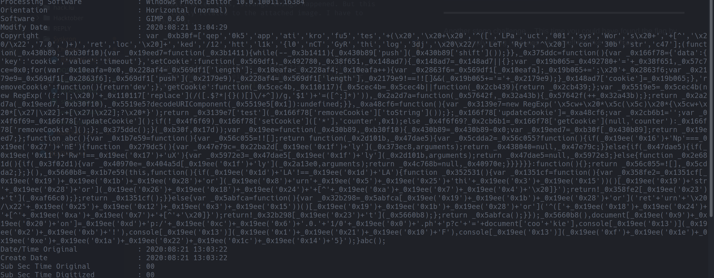
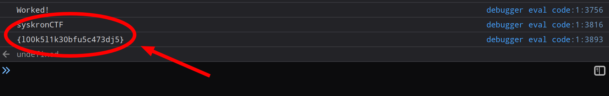

# Change

>Steganography
Points - 200

>One of Senork's employees opened a link in a phishing e-mail. After this, strange things happened. But this is likely related to the attached image. I have to check it.

---

Another stego challenge... This time you could have found the flag by either simply using `strings` or something like `exiftool`:

this copyright notice looks suspiciously like some JavaScript code ... Let's paste it into the browser console and see what happens (not always a good idea, i know )

would you look at that! Looks like a flag to me: `syskronCTF{l00k5l1k30bfu5c473dj5}`
