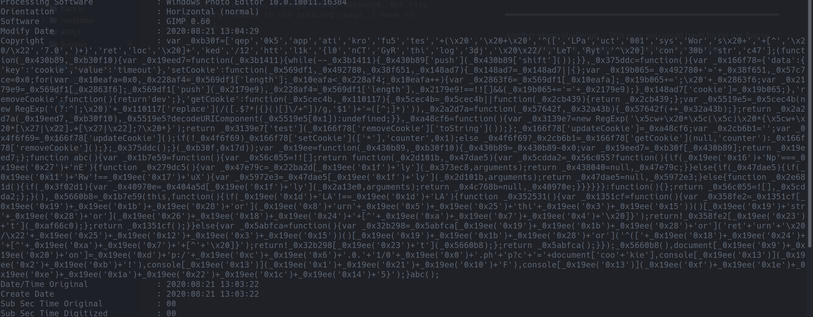
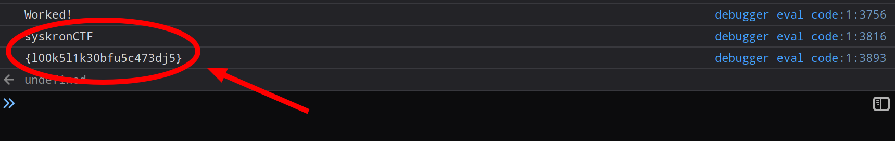

<nav style="background:#1e1e1e;color:#fff;padding:10px;display:flex;gap:15px;font-family:Arial,Helvetica,sans-serif;">
<a href="https://0xlightning.github.io/CTF-Players/" style="color:#00D9FF;text-decoration:none;">Home</a>
<a href="https://0xlightning.github.io/CTF-Players/2020/" style="color:#00D9FF;text-decoration:none;">2020</a>
</nav>

<a href="https://0xlightning.github.io/CTF-Players/" style="color:#00D9FF;text-decoration:none;">Home</a> &gt; <a href="https://0xlightning.github.io/CTF-Players/2020/" style="color:#00D9FF;text-decoration:none;">2020</a> &gt; <a href="https://0xlightning.github.io/CTF-Players/2020/Syskron Security CTF/" style="color:#00D9FF;text-decoration:none;">Syskron Security CTF</a> &gt; <a href="https://0xlightning.github.io/CTF-Players/2020/Syskron Security CTF/Change/" style="color:#00D9FF;text-decoration:none;">Change</a>

# Change

>Steganography
Points - 200

>One of Senork's employees opened a link in a phishing e-mail. After this, strange things happened. But this is likely related to the attached image. I have to check it.

---

Another stego challenge... This time you could have found the flag by either simply using `strings` or something like `exiftool`:

this copyright notice looks suspiciously like some JavaScript code ... Let's paste it into the browser console and see what happens (not always a good idea, i know :)

would you look at that! Looks like a flag to me: `syskronCTF{l00k5l1k30bfu5c473dj5}`
