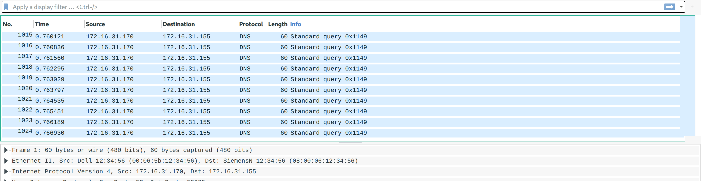

<nav style="background:#1e1e1e;color:#fff;padding:10px;display:flex;gap:15px;font-family:Arial,Helvetica,sans-serif;">
<a href="https://0xlightning.github.io/CTF-Players/" style="color:#00D9FF;text-decoration:none;">Home</a>
<a href="https://0xlightning.github.io/CTF-Players/2020/" style="color:#00D9FF;text-decoration:none;">2020</a>
</nav>

<a href="https://0xlightning.github.io/CTF-Players/" style="color:#00D9FF;text-decoration:none;">Home</a> &gt; <a href="https://0xlightning.github.io/CTF-Players/2020/" style="color:#00D9FF;text-decoration:none;">2020</a> &gt; <a href="https://0xlightning.github.io/CTF-Players/2020/Syskron Security CTF/" style="color:#00D9FF;text-decoration:none;">Syskron Security CTF</a> &gt; <a href="https://0xlightning.github.io/CTF-Players/2020/Syskron Security CTF/DOS Attack/" style="color:#00D9FF;text-decoration:none;">DOS Attack</a>

# DOS Attack

>OSINT

>Points - 100

>One customer of Senork Vertriebs GmbH reports that some older Siemens devices repeatedly crash. We looked into it and it seems that there is some malicious network traffic that triggers a DoS condition. Can you please identify the malware used in the DoS attack? We attached the relevant network traffic.
Flag format: syskronCTF{name-of-the-malware}

---

First, take a quick look at the provided _pcap_ file. See that it consists solely of DNS queries:

now simply do a Google search for something like `siemens dos dns` - looking at the results you'll find several articles like [this one](https://www.securityweek.com/flaws-expose-siemens-protection-relays-dos-attacks) which inform you that the malware's name is in fact `Industroyer`.

The flag therefore was: `flag{Industroyer}`
