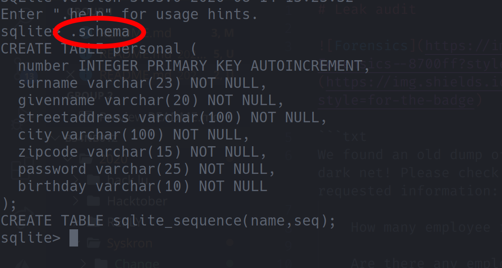

# Leak audit

>Forensics

>Points - 200

```
We found an old dump of our employee database on the dark net! Please check the database and send us the requested information:

    How many employee records are in the file?

    Are there any employees that use the same password? (If true, send us the password for further investigation.)

    In 2017, we switched to bcrypt to securely store the passwords. How many records are protected with bcrypt?

Flag format: answer1_answer2_answer3 (e.g., 1000_passw0rd_987).
```

---

The simplest way to solve this is probably to just open the databsae using `sqlite3` ... A simple `.schema` will now inform you about the database's general structure:



Now... simply use three or less queries to answer all of the task statement's questions:

1. _How many employee records are in the file?_

```sql
SELECT COUNT(*)
FROM   personal;
```

```txt
376
```

2. _Are there any employees that use the same password? (If true, send us the password for further investigation.)_

```sql
SELECT    password, COUNT(*) "count"
FROM      personal
GROUP BY  password
HAVING    count > 1;
```

```txt
mah6geiVoo|2
```

3. _In 2017, we switched to bcrypt to securely store the passwords. How many records are protected with bcrypt?_

```sql
SELECT  COUNT(*) 
FROM    personal 
WHERE   password LIKE '$2b$%';
```

```
21
```

Now, reconstructing the flag was no problem at all: `flag{376_mah6geiVoo_21}`
