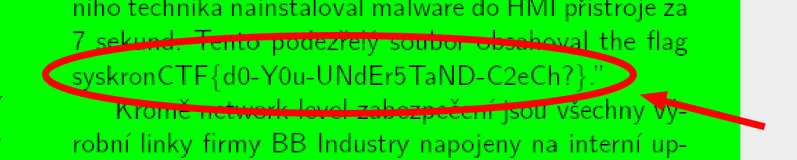

<nav style="background:#1e1e1e;color:#fff;padding:10px;display:flex;gap:15px;font-family:Arial,Helvetica,sans-serif;">
<a href="https://0xlightning.github.io/CTF-Players/" style="color:#00D9FF;text-decoration:none;">Home</a>
<a href="https://0xlightning.github.io/CTF-Players/2020/" style="color:#00D9FF;text-decoration:none;">2020</a>
</nav>

<a href="https://0xlightning.github.io/CTF-Players/" style="color:#00D9FF;text-decoration:none;">Home</a> &gt; <a href="https://0xlightning.github.io/CTF-Players/2020/" style="color:#00D9FF;text-decoration:none;">2020</a> &gt; <a href="https://0xlightning.github.io/CTF-Players/2020/Syskron Security CTF/" style="color:#00D9FF;text-decoration:none;">Syskron Security CTF</a> &gt; <a href="https://0xlightning.github.io/CTF-Players/2020/Syskron Security CTF/Redacted news/" style="color:#00D9FF;text-decoration:none;">Redacted news</a>

# Redacted news

>Steganography

>Points - 100

> Oh, this is a news report on our Secure Line project. But someone removed a part of the story?!

---

Like pretty much every _steganography_ challenge, this one too can be solved by simply using `stegsolve`.

 the flag was: `syskronCTF{d0-Y0u-UNdEr5TaND-C2eCh?}`
