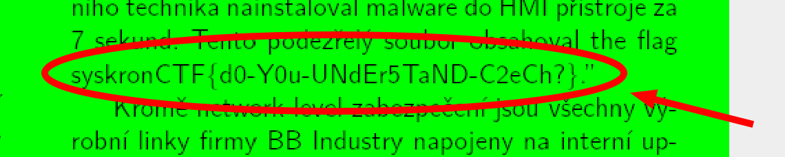

# Redacted news

Points - 100

> Oh, this is a news report on our Secure Line project. But someone removed a part of the story?!

---

Like pretty much every _steganography_ challenge, this one too can be solved by simply using `stegsolve`.

 the flag was: `syskronCTF{d0-Y0u-UNdEr5TaND-C2eCh?}`
