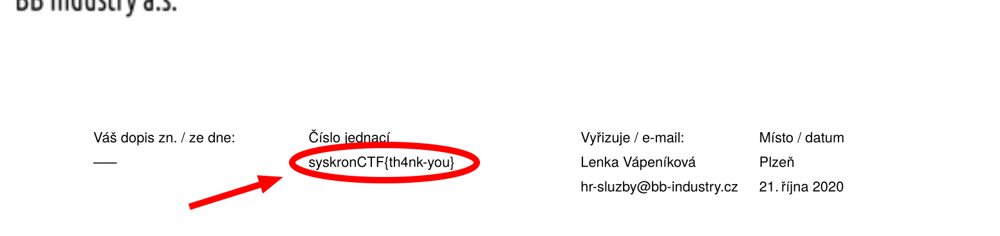

# Welcome Letter

>Sanitycheck

>Points - 20

`Read the letter
Actually the task description is pretty precise about what you need to do .`

---

Near the top of the PDF file you'll be able to see the first flag: `syskronCTF{th4nk-you}`
