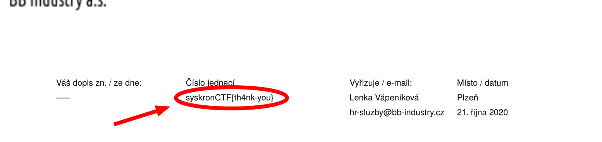

<nav style="background:#1e1e1e;color:#fff;padding:10px;display:flex;gap:15px;font-family:Arial,Helvetica,sans-serif;">
<a href="https://0xlightning.github.io/CTF-Players/" style="color:#00D9FF;text-decoration:none;">Home</a>
<a href="https://0xlightning.github.io/CTF-Players/2020/" style="color:#00D9FF;text-decoration:none;">2020</a>
</nav>

<a href="https://0xlightning.github.io/CTF-Players/" style="color:#00D9FF;text-decoration:none;">Home</a> &gt; <a href="https://0xlightning.github.io/CTF-Players/2020/" style="color:#00D9FF;text-decoration:none;">2020</a> &gt; <a href="https://0xlightning.github.io/CTF-Players/2020/Syskron Security CTF/" style="color:#00D9FF;text-decoration:none;">Syskron Security CTF</a> &gt; <a href="https://0xlightning.github.io/CTF-Players/2020/Syskron Security CTF/Welcome Letter/" style="color:#00D9FF;text-decoration:none;">Welcome Letter</a>

# Welcome Letter

>Sanitycheck

>Points - 20

>Read the letter

>Actually the task description is pretty precise about what you need to do .

---

Near the top of the PDF file you'll be able to see the first flag: `syskronCTF{th4nk-you}`
