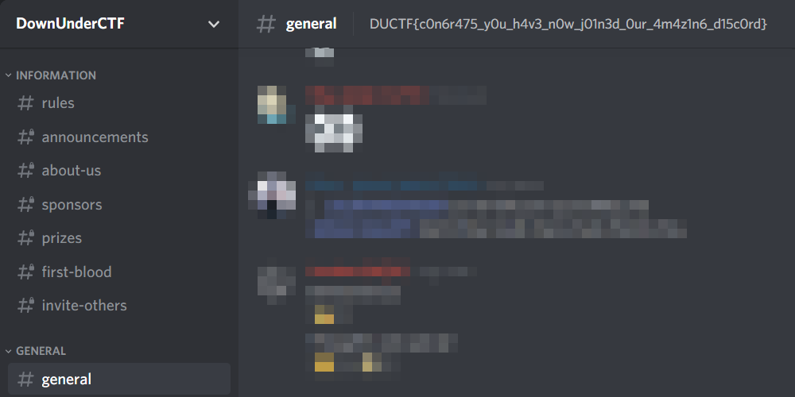

# OUR FIRST WRITEUP :?
- [Web](#web)
    - [Leggos](#leggos)
- [Misc](#misc)
    - [Welcome!](#welcome)
    - [16 Home Runs](#16-home-runs)
    - [Tim Tams](#Tim-Tams)
    - [Discord](#Discord)
    - [Twitter](#Twitter)
- [Forensics](#forensics)
    - [On the spectrum](#on-the-spectrum)


# <a name="web"></a> Web
## <a name="leggos"></a> Leggos
Points: 100

#### Description
>I <3 Pasta! I won't tell you what my special secret sauce is though!
>
>https://chal.duc.tf:30101

### Solution
We are prompted with a page containing some text and an image. Trying to view the source HTML we notice that we can't do a Right Click. 


No problem, we append in the URL `view-source:`, so it becomes `view-source:https://chal.duc.tf:30101/`. Inside the HTML we have a hint saying `<!-- almost there -->`. We open the source code of an imported JS file and we get the flag.


Flag: DUCTF{n0_k37chup_ju57_54uc3_r4w_54uc3_9873984579843}

# <a name="misc"></a> Misc
## <a name="welcome"></a> Welcome
Points: 100

#### Description
>Welcome to DUCTF!
>
>ssh ductf@chal.duc.tf -p 30301
>
>Password: ductf


### Solution
When you connect to the machine a bounch of messages are displayed and you can not execute any command. I tried to `scp` the whole home directory, but the script that displayed the messages on ssh connection was throwing some error. Looking more closely, the flag is displayed among the other messages.


Flag: DUCTF{w3lc0m3_t0_DUCTF_h4v3_fun!}

## <a name="16 Home Runs"></a> 16 Home Runs
Points: 100

#### Description
>How does this string relate to baseball in anyway? What even is baseball? And how does this relate to Cyber Security? ¯(ツ)/¯
>
>`RFVDVEZ7MTZfaDBtM19ydW41X20zNG41X3J1bm4xbjZfcDQ1N182NF9iNDUzNX0=`

### Solution
I have no idea about baseball, but I know that the string looks like encoding and it's not base 16 (hex). Base64 deconding it gives us the flag.


Flag: DUCTF{16_h0m3_run5_m34n5_runn1n6_p457_64_b4535}

## <a name="Tim Tams"></a>Tim Tams

Points : 273

#### Description

``` When I eat too many Tim Tams, I get rather slow!

WARNING You will want to turn down your audio for this one!

Download: https://storage.googleapis.com/files.duc.tf/uploads/Clive.wav

File Hash (SHA256): 4C1CC12D002956A83E168CA650B776B55AAC36F2131D0DF617BE7D55DBEF93D1 
```
### SOLUTION

We are given a really noisy wav audio file, I had no clue of solving this at first when my regular audio steganography tools failed. But my teammate came into play with a really good suggestion. **QSSTV !**

https://storage.googleapis.com/files.duc.tf/uploads/Clive.wav

**QSSTV** is a utility for dealing with slow scan television signals. From the challenge description, we can pick out a hint “When I eat too many Tim Tams, I get rather slow!”.

I used the following commands to setup qsstv on linux

```
sudo apt-get install pavucontrol
sudo apt-get install qsstv
```

We need the pavucontrol utility to be able to open audio files.

Type qsstv on the terminal to open the program and select the audio file you’re going to work with


qsstv maps the wav audio into an image and we can see at the top left what appears to be an encoded flag.`QHGPS{UHZOYR_Z3Z3_1BEQ}`

This is ROT13, we decode the flag to: `DUTCF{HUMBLE_M3M3_1ORD}`

Flag: DUTCF{HUMBLE_M3M3_1ORD}

## <a name="Discord"></a> Discord
Points : 10

#### Description

JOIN OUR DISCORD!  
  

### Solution
Take a look at the official [Discord](https://duc.tf/discord).
It was written in general.
 

Flag : DUCTF{c0n6r475_y0u_h4v3_n0w_j01n3d_0ur_4m4z1n6_d15c0rd}

## <a name="Twitter"></a> Twitter
Points : 10

#### Description
> Check out our Twitter! Find the post with the flag! You can give us a follow if you like <3  

### Solution

>Take a look at the official [Twitter](https://twitter.com/DownUnderCTF).
>There are those tweets, but they seem to be base64 encoded.
>
>Decode. 
```bash
$ python
>>> import base64
>>> text = "RFVDVEZ7aHR0cHM6Ly93d3cueW91dHViZS5jb20vd2F0Y2g/dj1YZlI5aVk1eTk0c30="
>>> print(base64.b64decode(text))
b'DUCTF{https://www.youtube.com/watch?v=XfR9iY5y94s}'
```

Flag : DUCTF{https&#58;//www.youtube.com/watch?v=XfR9iY5y94s}

# <a name="forensics"></a> Forensics
## <a name="on-the-spectrum"></a> On the spectrum
Points: 100

#### Description
>My friend has been sending me lots of WAV files, I think he is trying to communicate with me, what is the message he sent?
>
>Author: scsc
>
>Attached files:
>
>   message_1.wav (sha256: 069dacbd6d6d5ed9c0228a6f94bbbec4086bcf70a4eb7a150f3be0e09862b5ed)

### Solution
We get a `.wav` file and, as the title suggest, we might find the flag in the spectogram. For viewing it I used [Sonic Visualizer](https://sonicvisualiser.org/). I played a little with the settings to view it better.


Flag: DUCTF{m4bye_n0t_s0_h1dd3n}
